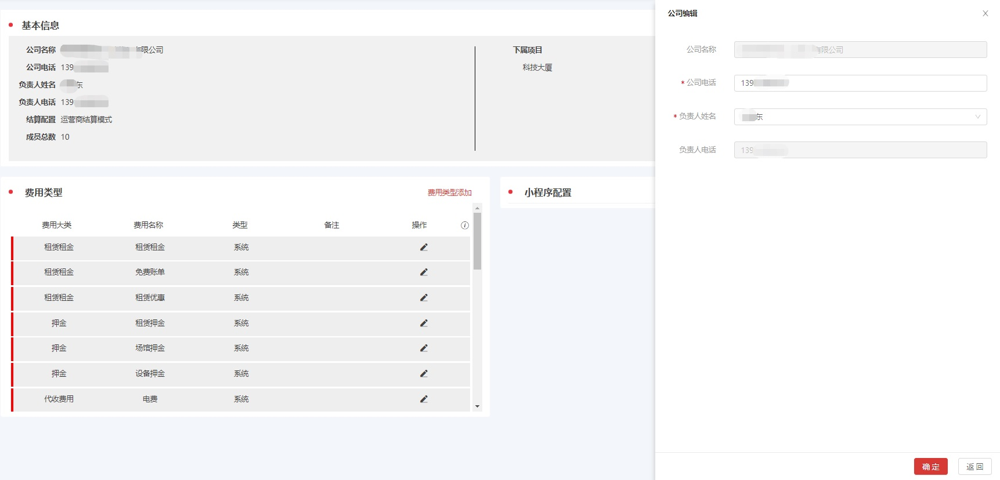
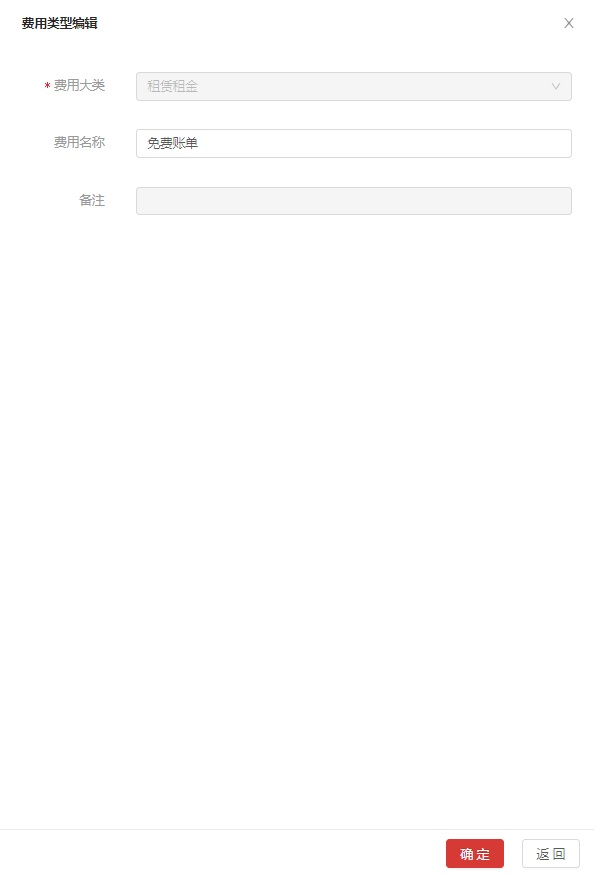
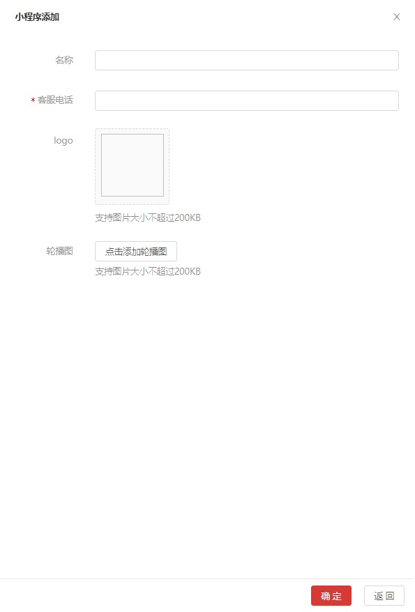
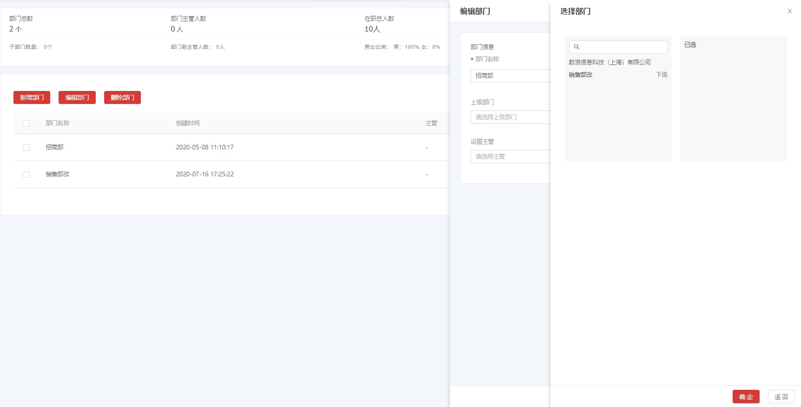
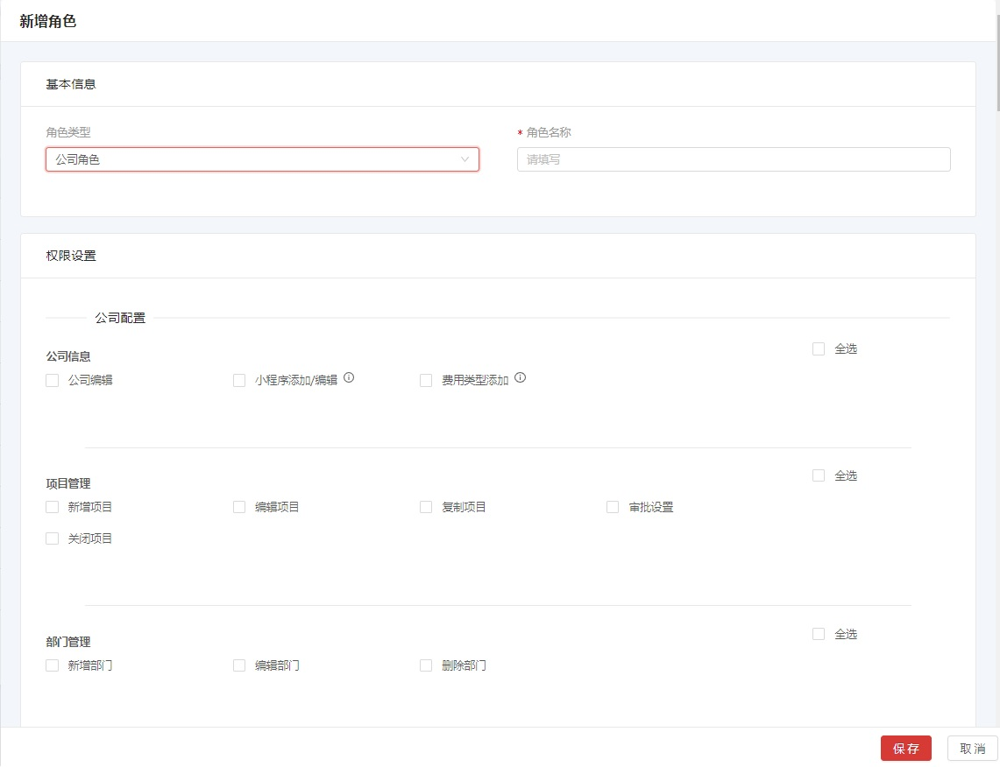
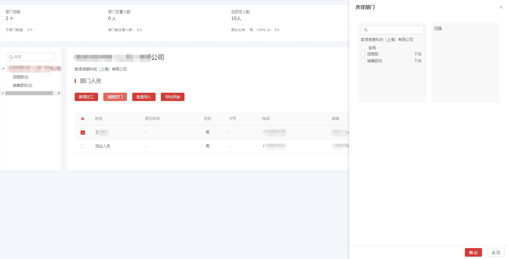
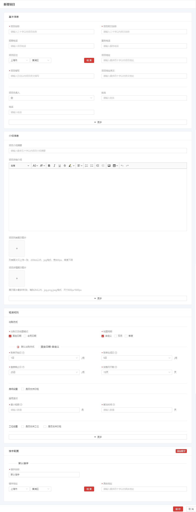
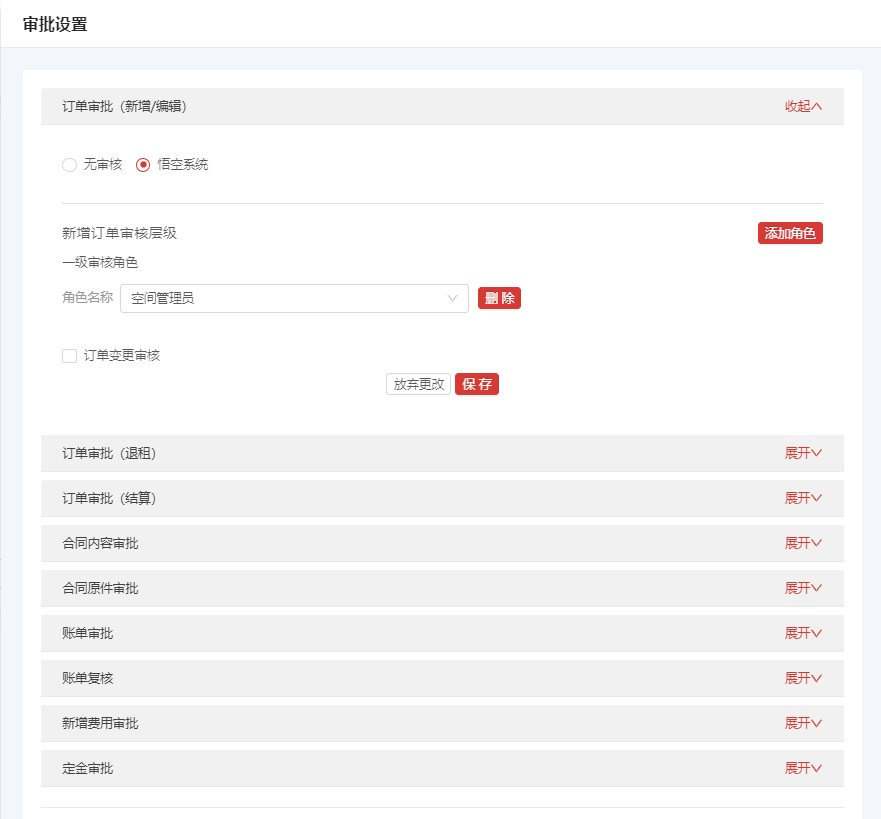
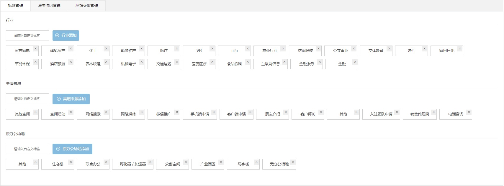

# 公司配置
!!! note ""
    在公司配置下、可以对部门、人员组织信息进行维护，管理人员的系统权限，配置公司所属的项目，同时也能够设置系统需要对接的第三方平台信息

### **公司信息**
***
####编辑基本信息
点击  **·基本信息** 右侧的 **`编辑`** 按钮，可以修改公司电话和负责人。  

####添加/编辑费用类型
点击  **·费用类型** 右侧的 **`添加`** 按钮，可以添加新的 **费用类型**。  

点击单个费用类型后的 **`编辑`** 按钮，可以编辑名称， **自定义** 的费用类型能够 **`删除`**。  

费用大类不可以修改。  
费用类型是在  **<u>财务管理·费用明细·创建费用</u>** 时使用的。

####编辑小程序配置
点击  **·小程序配置** 右侧的 **`编辑`** 按钮，可以配置小程序名称、客服电话、logo、轮播图  

***

### **部门管理**
***

可以 **新增部门**、**编辑部门**、**删除部门**。编辑、删除部门时需要先从列表里选取。  

系统支持自定义部门和从钉钉同步部门信息。  
对于从钉钉同步过来的部门，名称后有钉钉的标志，再次同步后会覆盖在系统内修改的信息。  
系统自定义的部门信息不受钉钉同步的影响。

点击记录，在 **<u>部门详情</u>** 页面会显示部门的详细信息，点击 **`编辑`** 按钮，可以在 **<u>编辑部门</u>** 页面 维护部门的名称、人员、主管等

***

### **角色管理**

***

可以 **新增角色**、**编辑角色**、**删除角色**、**复制角色**。

####新增角色
点击 **`新增角色`** 按钮，打开 **<u>新增角色</u>** 页面。  

- 角色设定  
角色有 **公司角色** 和 **项目角色** 两种类型，根据选取 **角色类型** 的不同，可设定的公司视图、项目视图的业务模块是不同的
 

- 权限设置   
选取 **角色类型** 后，会罗列出所选 **角色类型** 能够操作的业务的列表。可勾选新增的角色在各个业务模块的权限。
 

####编辑
选取需要编辑的角色记录，点击 **`编辑`** 按钮，可以在 **<u>编辑角色</u>** 页面维护此角色在各个业务模块的权限。**角色类型** 是不能修改的

####复制角色
**<u>编辑角色</u>** 页面，点击 **`复制角色`** 按钮，复制当前角色的角色类型和业务模块的权限，用来快速新增角色

####删除角色
**<u>编辑角色</u>** 页面，点击 **`删除角色`** 按钮，删除掉当前的角色

***

### **人员管理**

***
可以在 搜索 框内输入文字，快速搜索部门或人员

####新增员工
点击 **`新增员工`** 按钮，在 **`新增员工`** 页面，设置员工的 **基础信息**、**公司角色**、**项目权限**、**门禁权限**

####编辑
在列表中点击需要编辑的员工记录，在打开的 **<u>编辑人员</u>** 页面，可以编辑员工的 **基础信息**、**公司角色**、**空间权限**、**门禁权限**

####离职
在 **<u>编辑人员</u>** 页面，点击 **`员工离职`** 按钮，选择员工离职的原因，如果选中 **`离职后直接删除员工`**，当前员工的记录会删除掉。如果不选中，当前员工的记录会保留，状态会变为 **离职**，

####锁定、解锁
在 **<u>编辑人员</u>** 页面，点击 **员工锁定** 按钮，员工的权限会被冻结，无法登录系统。被 **锁定** 的员工，点击 **解锁** 按钮，可以恢复权限

####调整部门
可以选组一个员工，调整该员工的所属部门

***

### **项目管理**

***

####新增项目

可以 **新增项目**、**编辑项目**、**复制项目**、**关闭项目**。编辑、复制、关闭项目时需要先从列表里选取  

在 **<u>项目列表</u>** 页面 
点击页面右侧的 **`新增项目`** 按钮，打开 **<u>新增项目</u>** 页面，输入项目的信息  

- 基本信息 
   
  项目名称等基本信息，按照提示输入即可 
  项目房源类型
   
  可以设置此项目的房源是否可租售。可租、可售都选中的话此项目的房源既可以出租也可以出售 
  订单租用方式
   
  可设置房源是否可以预租.
  
- 介绍信息  
  可上传图片，也可输入项目的详细文字介绍  
- 租赁规则
   
  出账方式 
  - 按固定日期出账：按照设置的固定的日期出账单  
     结算周期支持自定义、双月、季度 三种设置  
     结算周期为双月的时候，合同的开始日期如果不是单月的1日，从合同的开始日期开始到
     第一个双月的月末日期结束为一个账单，以后从单元的1日开始以2个月为周期分割账单
  - 按合同日期出账：按照合同的日期，根据设置的提前多少天出账单
   
    
!!! note ""
    项目内基础设施的配置。如房源、场馆、设备、门禁及控制器、打印机等
    
!!! info "有几个概念"  
    **账单开始日**：账单开始的日期  
    **账单生成日**：账单生成的日期即账单的计入日期  
    **缴费截止日**：缴费的截止日期，如果超过截止日期，可能会收取违约金  
    **按整月天数**：超过（包含）此天数即算为整月
    **按整季天数**：超过（包含）此天数即算为整季 
  
    

- 房间设置
    
  按照提示输入即可，按月支付和按天支付至少需要输入一项。需要注意的事，只有
  这里设置了按月支付，在新增房间的时候才可以设置月租的租用方式。同理，只有
  设置了按天支付，在新增房间的时候才可以设置日租的租用方式。  

- 工位设置
   同 房间设置
  
- 结算期限
   
  退租，完租后多少天之后才可以进行订单结算
   
- 财务团队等其他项按照提示输入即可

 

####审批设置
可支持 **无审核** 及 **本系统（悟空宝盒）**、**钉钉** 三种审批流的设置

### **第三方平台**
***

和第三方平台对接的认证都在此设置。系统支持 **钉钉**、**民生银行**

***

### **类别管理**

***

在 **<u>标签管理</u>** 页面 可以维护 **<u>招商管理/客户管理</u>** 页面内用来选择的 **客户行业**、 **客户渠道来源**  
在 **<u>流失原因管理</u>** 页面 可以维护 **<u>招商管理/意向管理</u>** 页面内用来选择的 **流失原因**
在 **<u>场馆类型管理</u>** 页面 可以维护 **<u>办公资产/场馆维护</u>** 页面内用来选择的 **场馆类型**

***