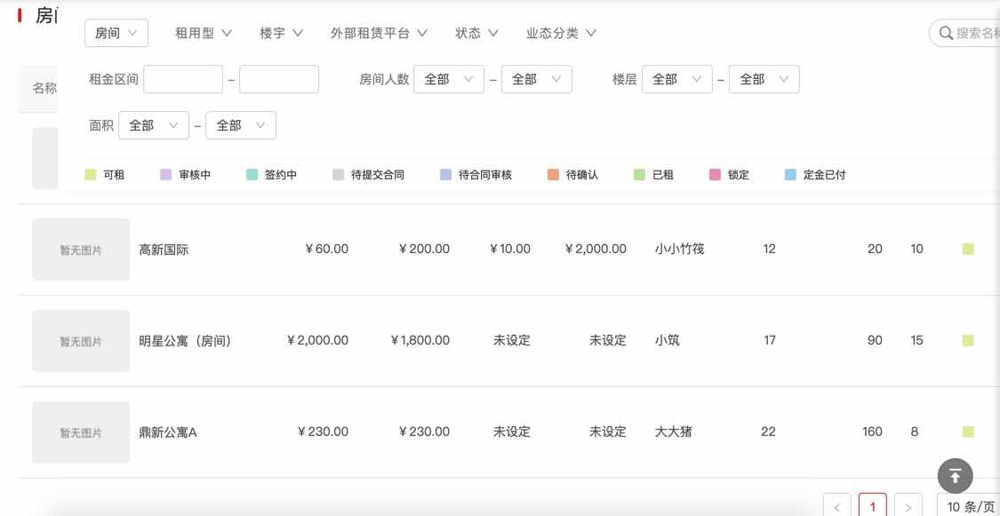
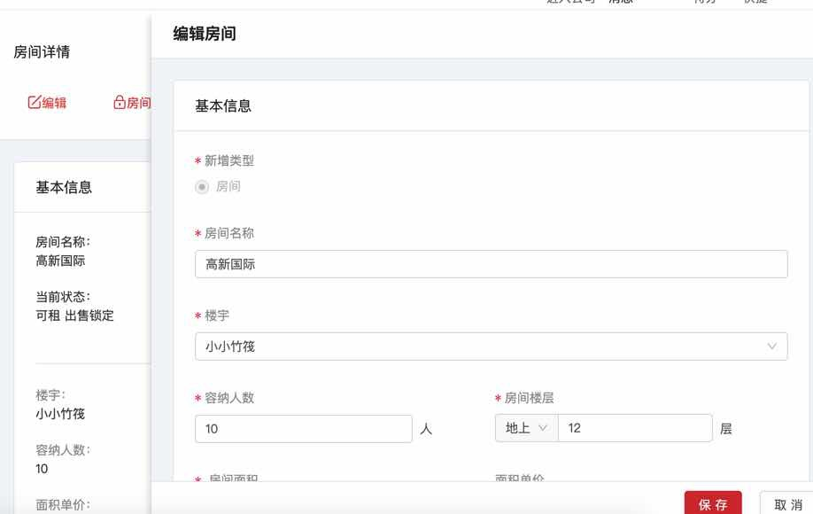
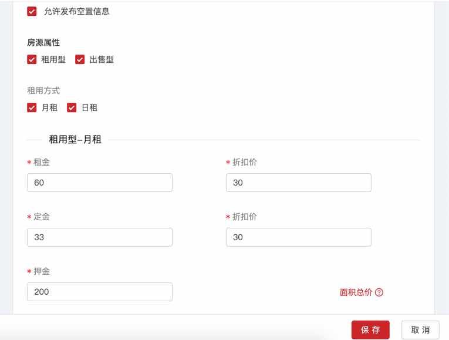
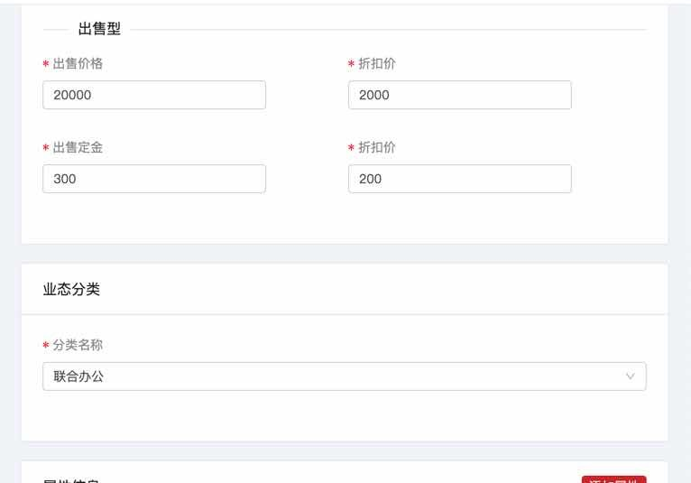
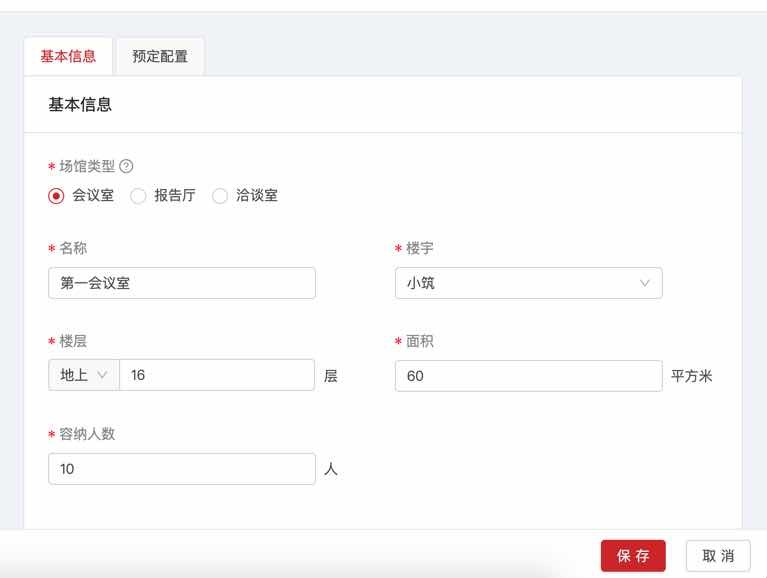
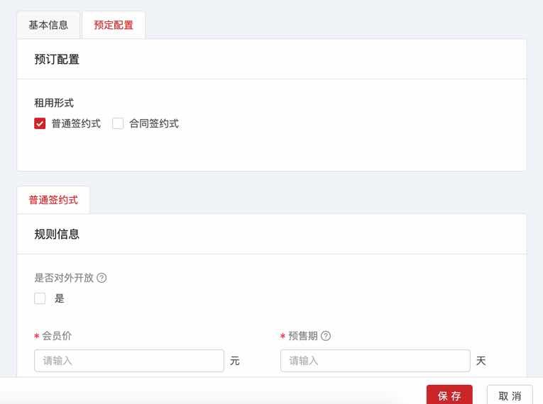
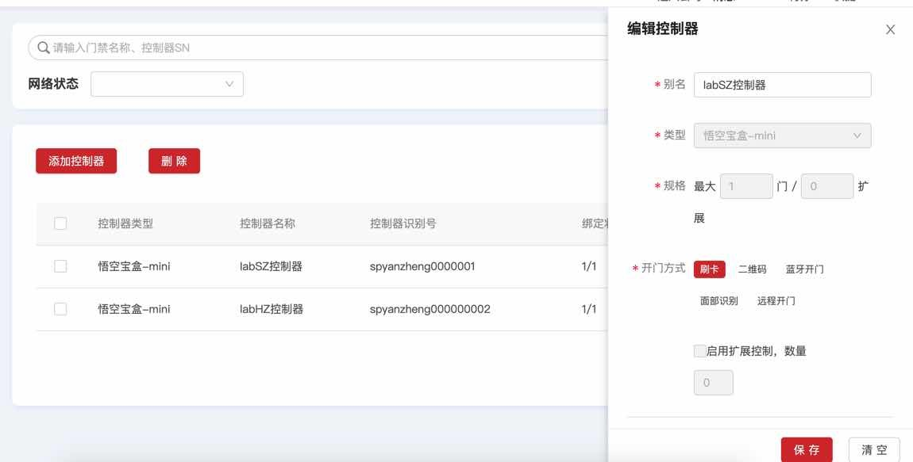
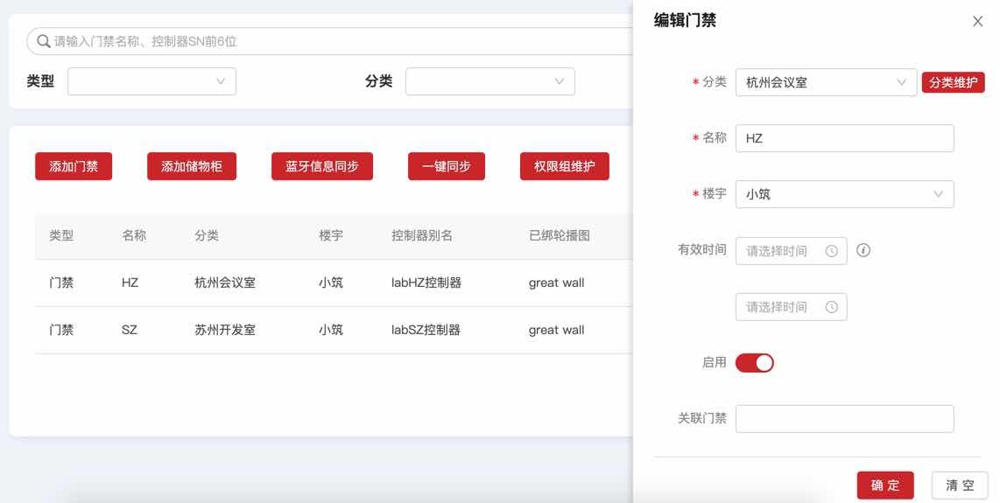

# 办公资产
!!! note ""
    项目内基础设施的配置。如房源、场馆、设备、门禁及控制器、打印机等
   
### **房源维护**
***

####新建/编辑房源
需要先设置项目中所拥有的房源，才能在项目中租售。

- 基本信息 
    - 新增类型  
   设置房源属性是 **房间** 还是 **工位**，房间支持出租和出售，工位只支持出租
    - 外部租赁平台
   如果定制对接外部租赁平台，可设置是否允许向外部租赁平台发布 **空置信息**  
   - 房源属性  
   如果是房间的话，可以设置是 **可租** 还是 **可售**，相互不冲突
   - 租用方式  
   可以按 **月** 租用还是可以按 **日** 租用
   - 其他按照提示输入即可
 

- 业态分类
 
选取房源的主营业态

- 属性信息
 
可设置房源的有特色的属性，点击 **`添加属性`** 可添加多项

- 关联门禁
 
在 **<u>门禁维护</u>** 设置好门禁类型后，可在此处配置当前房源所具有的门禁权限

- 展示信息
 
可上传图片，也可输入房源的详细文字介绍

####锁定/解锁
在 **<u>房源详情</u>** 页面，可以锁定房间，使该房间暂时不能出租或出售，也可以解锁
对于工位，可以设定 锁定/解锁的数量

***

### **场馆维护**
***

####新增/编辑场馆
需要先设置项目中所拥有的会议室，洽谈室等场馆，客户才能租用。

- 基本信息 
 按照提示输入即可

- 展示信息
 
可上传展示介绍的图片

- 预订配置

 
    - 普通签约式：无需签订合同就可以预订、租用的会议室等场馆，主要面向项目入驻团队
    - 合同签约式：需要签订合同才可以租用的大型会议室、报告厅等场馆。可以面向外部客户。

- 设备信息
 
在 **<u>设备维护</u>** 设置好所有设备后，可以设定租用该场所的同事能够租用的设备。

- 关联门禁
 
在 **<u>门禁维护</u>** 设置好门禁类型后，可在此处配置当前房源所具有的门禁权限

####关闭场馆
在 **<u>场馆详情</u>** 页面，可以关闭

####打印二维码
在 **<u>场馆详情</u>** 页面，可以打印二维码

***

###控制器维护

***

- **别名**： 系统显示名称，用于添加门禁时需要根据别名选择控制器
- **类型**：控制器硬件类型，目前主要有【悟空宝盒-mini】和【悟空宝盒-standard】两种型号
- **规格**：单个控制器硬件可控制门数和可扩展端口数，扩展端口一般用于储物柜
- **开门方式**：根据不同控制器，选择不同开门方式
- **识别号**：控制器设备的唯一识别号
- **网络配置**: 控制器网络配置，选DHCP时IP地址等信息可不填写
- **IP地址**：控制器ip地址
- **蓝牙名称**：选择蓝牙开门的时候填写，蓝牙设备的pid_lockid_areaid_gateid
- **蓝牙地址**：蓝牙设备的mac地址

***

### **门禁维护**
***

####门禁配置

- **门禁分类**：可以添加，编辑。用于门禁分组。举个例子，可以根据楼层来划分分类，或者根据功能（梯控，轧机）划分。  
- **门禁名称**：系统显示门禁名，通常和房间号对应。
- **楼宇**：选择要配置哪个楼宇的门禁，选取后在依赖门禁列表中会显示当前楼宇的门禁。
- **有效时间**：如果设置了有效时间，此门只有在此时间段内才能被打开
- **启用**：打开状态该门禁可用
- **关联门禁配置**：配置现在的门禁，同时会拥有依赖门禁的权限。以大门和开发室为例，想去开发室必须经过大门，所以通常设置开发室门的时候将大门作为依赖门襟。这样为用户赋予门襟权限的时候，只选开发室即可同时拥有开发室和大门权限。
- **控制器**：当前门禁绑定的控制器，根据实际接线选择已添加控制器
- **门号**：当前门禁绑定控制器的门号，根据实际接线选择
- **开门方式**：选择需要的开门方式
- **轮播图片**：pad门禁控制设备显示的轮播图片。

####权限组维护
权限组是门禁权限的集合。可用于给入驻企业成员或者访客赋予门禁的权限。在 **<u>权限组维护</u>** 页面，设置以下的内容

- **权限组名称**：可以添加，编辑。
- **启用**：打开状态该权限组可用
- **门禁**：选取权限组所具有的门禁权限。

####储物柜配置
配置方法与门禁基本相同

